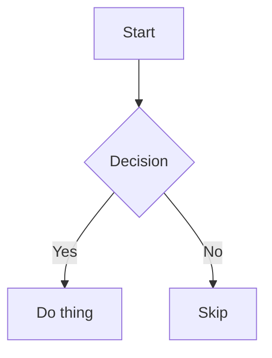

# Mermaid fences

A flowchart with a decision node, rendered as a text block:



An unsupported diagram type, which must fall back to a plain code block:

```mermaid
unknownDiagramType title Roadmap
```
