# Mermaid

Manual test doc for ` ```mermaid ` fence rendering. stele preprocesses the
source before `Document::parse`: every **top-level** mermaid fence is handed
to `mermaid::render` (the `mermaid-text` 0.57.0 crate), and on success the
whole fence is replaced by a plain `~~~` fence holding a Unicode box-drawing
grid. On *any* failure — empty body, unsupported diagram type, parse error —
the original fence is left exactly as written and displays as an ordinary
code block. That is the whole contract, and both halves of it are exercised
below.

Two things worth knowing before reading the expectations:

- **stele calls `mermaid::render` with no width budget.** The grid comes out
  at its natural size. Anything wider than the content column is then clipped
  by the *layout* engine with a `…` indicator (code-block lines are clipped,
  never wrapped) — the diagram renderer itself never scales to fit.
- **Only top-level fences are preprocessed.** `Document::blocks()` returns
  top-level blocks only, so a mermaid fence inside a list item or a blockquote
  is never touched and stays a code fence. This is deliberate: span
  replacement can then never overlap a parent block's span.

Every diagram below was rendered through `mermaid-text` 0.57.0 before being
committed here, and checked with siren's `validate.mjs` (static lint plus a
real `mmdc` v11.16.0 render). Where the two disagree, the note says so.

**No diagram here carries `accTitle`/`accDescr`, and that is deliberate.**
`validate.mjs` warns about their absence on every diagram — good advice for a
web target, wrong for this one. Measured against `mermaid-text` 0.57.0: in a
flowchart the two lines render as *two extra floating boxes* reading
`accTitle: …` and `accDescr: …`; in an `erDiagram` and a `sequenceDiagram`
they are hard parse errors that send the whole fence to the code-block
fallback. Accessibility metadata that breaks the render is not accessibility.
Those 14 warnings are expected output for this file, not defects.

Current validator score for this file: **33 diagrams extracted, 28 clean, 5
errors, 18 warnings**. All 5 errors are the deliberately-broken fences in
Part 4. Of the 18 warnings, 14 are the `accTitle` advice above, 3 are the
intentionally over-long labels in Part 3, and 1 is a lint false positive — the
static rule reads the `||--o{` crow's foot in the ER diagram as a node named
`o` with a 142-character label. Four further fences (the blockquote-nested
ones and the two non-`mermaid` info strings in Part 6) are not extracted by
the markdown scanner at all; those were validated separately as standalone
`.mmd` files and all four pass.

---

## Part 1 — one diagram per supported type

`mermaid-text` 0.57.0 detects eighteen diagram keywords. Each gets one
diagram here, and each models something real about stele rather than a
generic A→B→C.

### flowchart — the render pipeline

*expect: renders as a text grid, ~79 columns × 109 rows, with three subgraph
frames, a diamond decision node, a cylinder datastore and a stadium terminal;
validate.mjs: pass.*

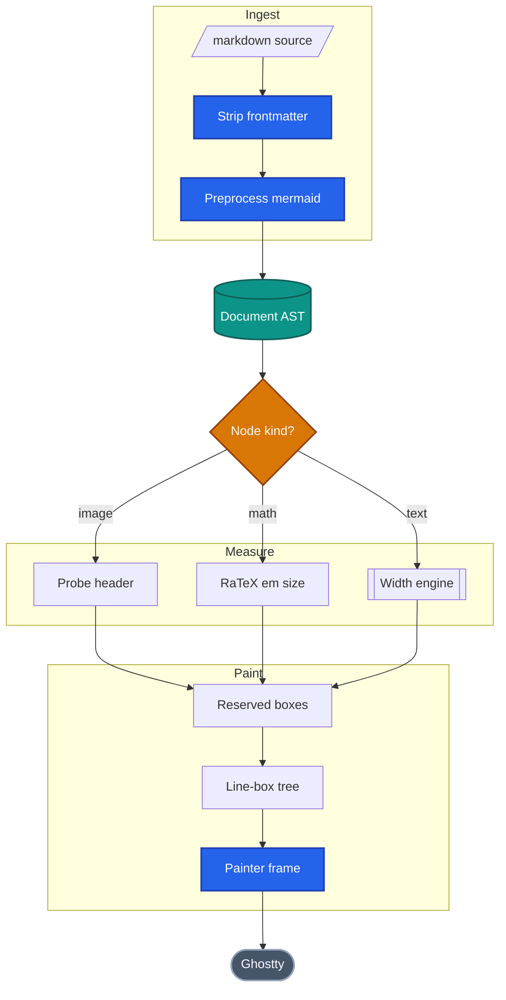

The `classDef`/`class` lines are the siren palette. `mermaid-text` documents
them as *silently ignored*, so in stele this renders monochrome — the same
source is colored on GitHub and structural in the terminal. That is expected,
not a defect.

### sequenceDiagram — the kitty graphics handshake

*expect: renders as a text grid with participant boxes repeated top and
bottom, `autonumber` step markers in `[n]` form, solid lines for calls and
dotted for replies; validate.mjs: pass.*

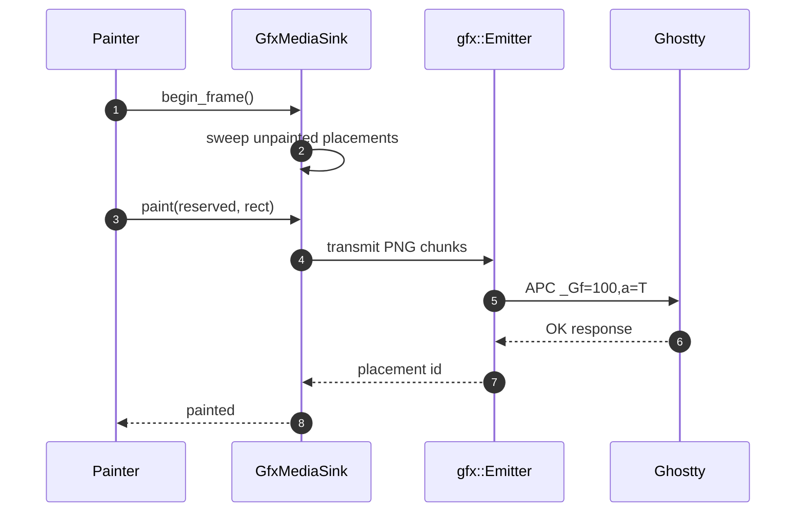

### stateDiagram-v2 — the media placement lifecycle

*expect: renders as a text grid; the `[*]` pseudo-states become filled-circle
nodes and transition labels float beside their edges; validate.mjs: pass.*

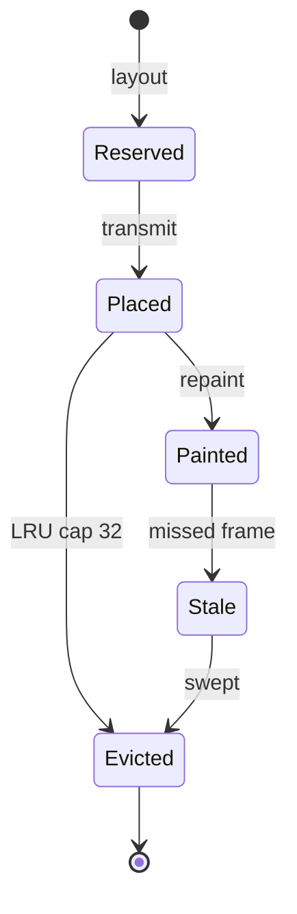

Transition labels are kept to one or two words on purpose. The renderer
places them at edge midpoints with no collision avoidance, exactly like
dagre — a verbose label such as `still in the viewport after a scroll` pushes
the whole grid past 130 columns and starts overlapping its neighbours.

### classDiagram — the `Decor` seam

*expect: renders as a text grid of three-compartment boxes with `<<interface>>`
stereotypes, hollow-triangle inheritance and a diamond aggregation;
validate.mjs: pass.*

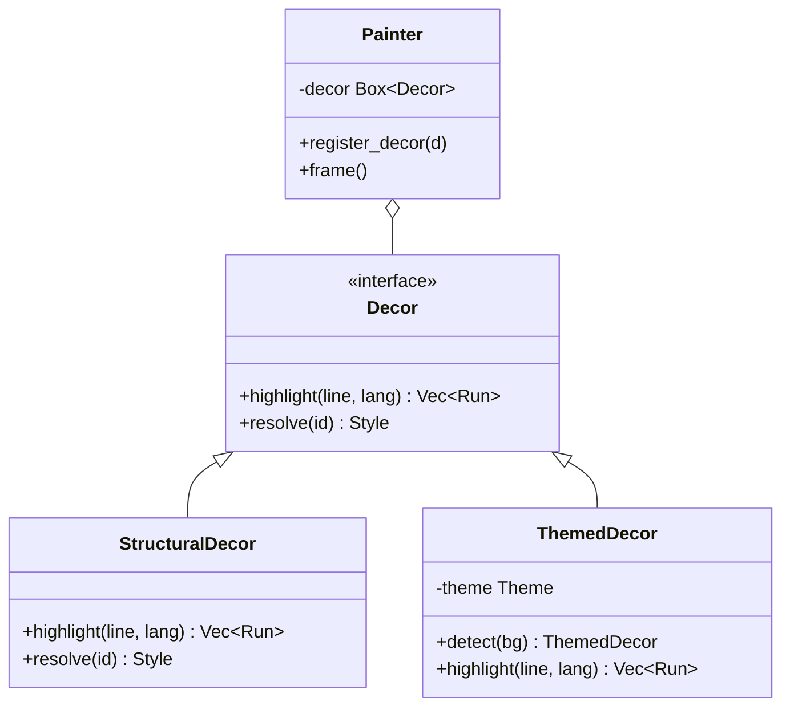

Members use the **block form** (`class X { ... }`). The colon shorthand
`Decor : +resolve(id) Style` is valid mermaid but a documented hole in
`mermaid-text` v1 — see the fallback section, where it is used on purpose.

### erDiagram — the document model

*expect: renders as a text grid of entity boxes joined by crow's-foot
cardinality markers, with relationship verbs printed along the joins;
validate.mjs: pass.*

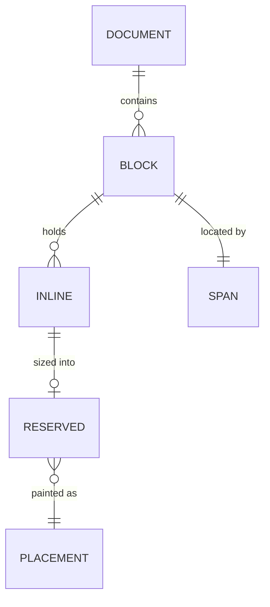

### journey — opening a large document

*expect: renders as a section/task tree with filled-star satisfaction scores
and the actor after an em dash; validate.mjs: pass.*

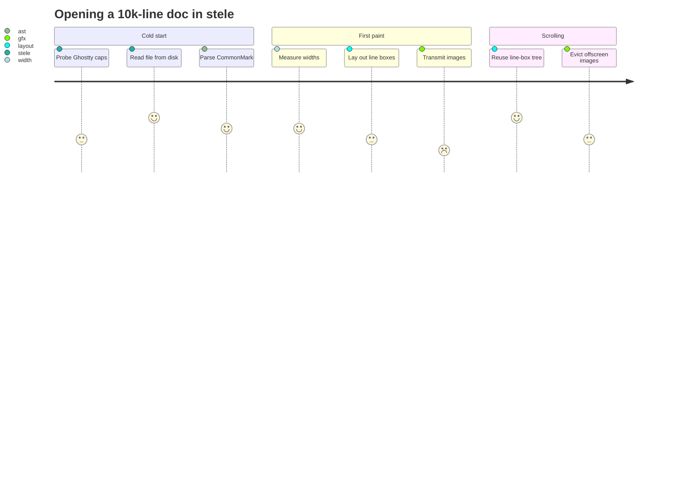

### gantt — the phase roadmap

*expect: renders as a horizontal bar chart with a shared date axis, `█` bars
on a `░` field and a per-task date range on the right; task names longer than
the label gutter are truncated with `…`; validate.mjs: pass.*

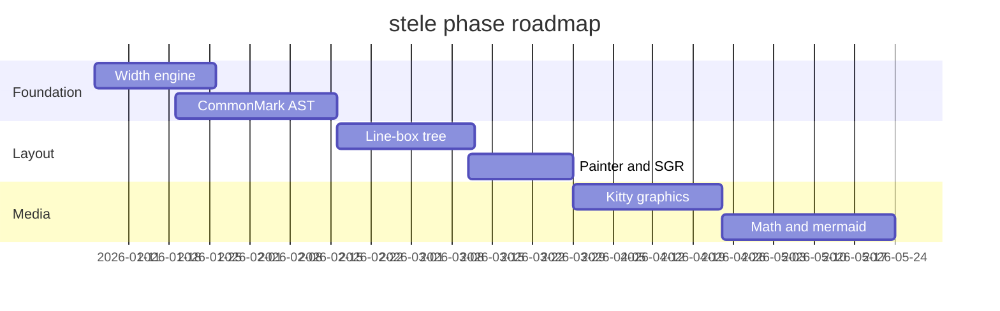

### timeline — degradation ladders by release

*expect: renders as a vertical bullet-on-a-wire flow, one `●` per period with
extra events hanging off `└──` connectors; validate.mjs: pass.*

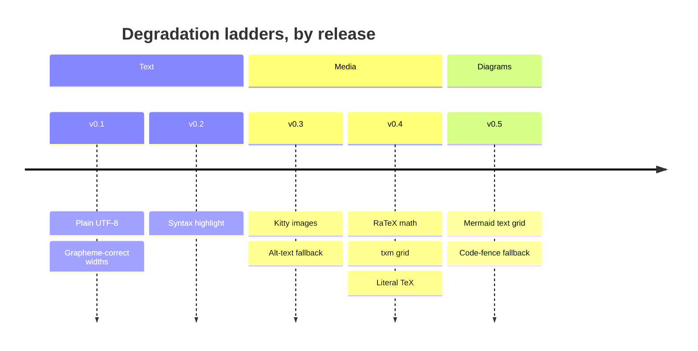

### gitGraph — how the crates landed

*expect: renders as a lane-based commit graph, branches as vertical columns
with a lane legend on the last row; tags print as `[v0.2]` beside their
commit; validate.mjs: pass.*

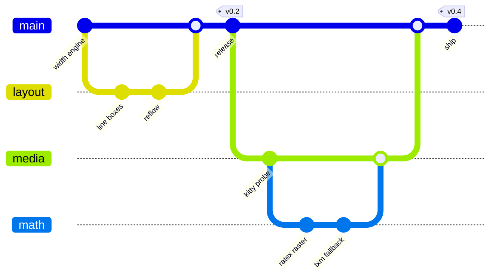

Note the tags sit on `commit`, not on `merge`. Mermaid proper accepts
`merge layout tag: "v0.2"`; `mermaid-text` 0.57.0 does not — it reads the
entire remainder of the line as the branch name and errors with
`merge: branch "layout tag: \"v0.2\"" does not exist`. Written that way this
fence would fall back to a code block, which is the contract working, but it
would not be a rendering test.

### mindmap — the crate map

*expect: renders as a vertical tree with the root in a rounded box and
`├──`/`└──` connectors below; validate.mjs: pass.*

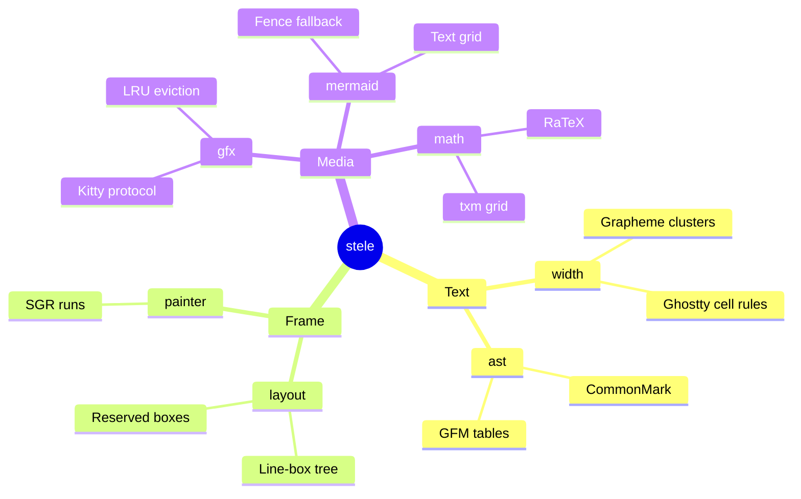

### quadrantChart — what was worth building

*expect: renders as a cross-axis matrix with the four quadrant labels in their
corners and each point placed proportionally, annotated with its coordinates;
validate.mjs: pass.*

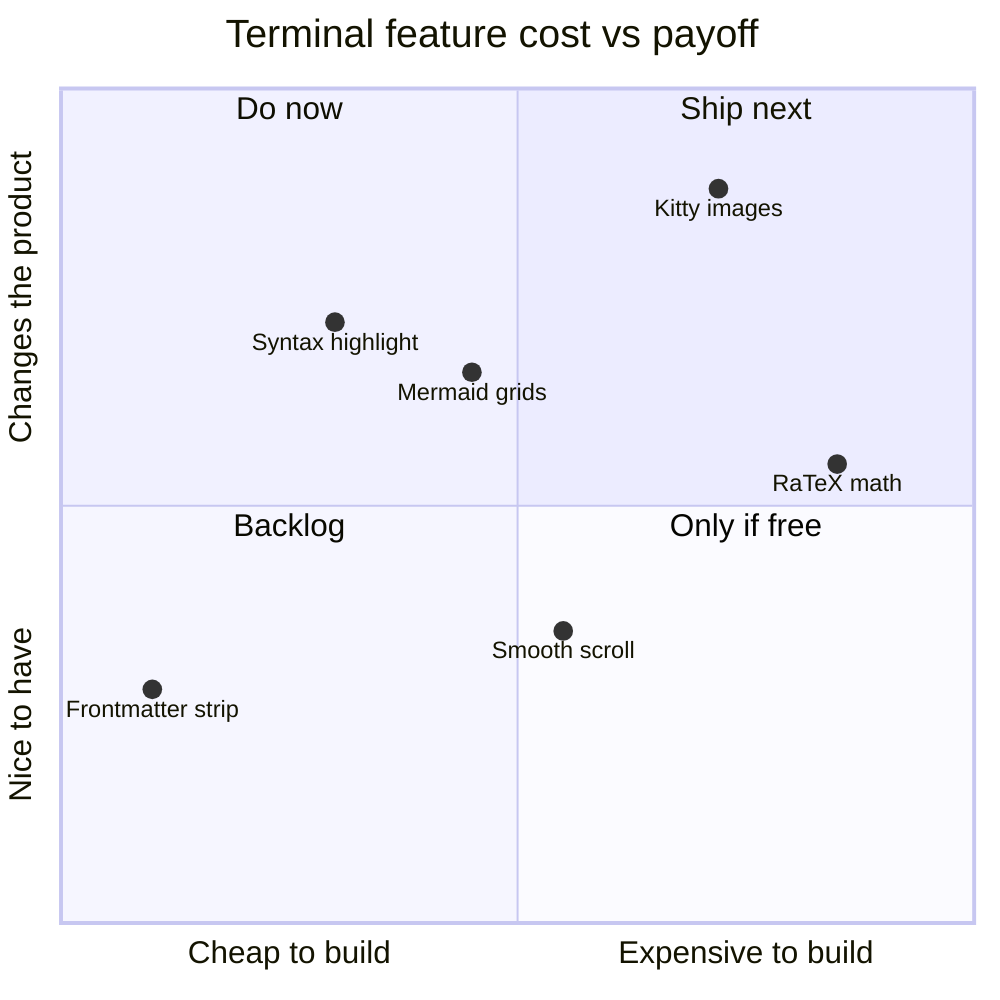

Point names are deliberately **unquoted**. `mermaid-text` does not strip
quotes from these, so `"Kitty images": [0.72, 0.88]` would render with the
quote marks visible.

### requirementDiagram — this phase's own done-when

*expect: renders as stacked stereotype boxes (square for requirements, rounded
for elements) with a plain `Relationships:` list underneath; long `text:` and
`docref:` values are truncated with `…`; validate.mjs: pass.*

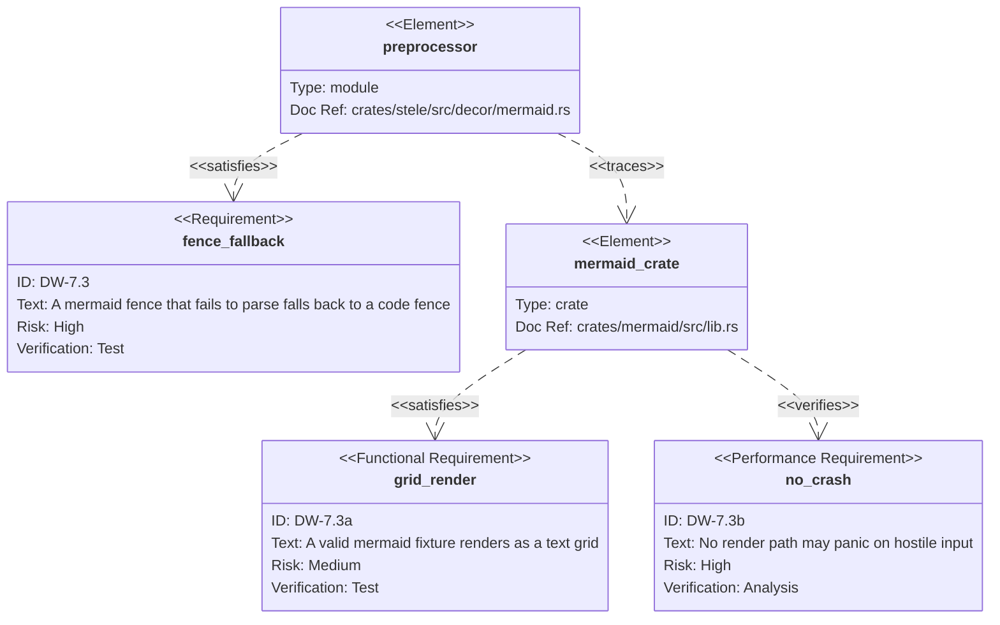

The `id:` values are quoted because a bare `DW-7.3` is a hard parse error in
mermaid proper — a hyphen inside an unquoted requirement id ends the token.
`mermaid-text` accepts either form but does not strip the quotes, so `"DW-7.3"`
prints with its quote marks in the grid. Quoted is the right trade: valid
everywhere, cosmetically imperfect in one place.

### sankey-beta — where the terminal columns go

*expect: renders as a grouped-arrow list — one header per source node with its
total, then proportional `█` bars for each outgoing flow. Not a true
proportional sankey; that is a documented Phase 2 item upstream;
validate.mjs: pass.*

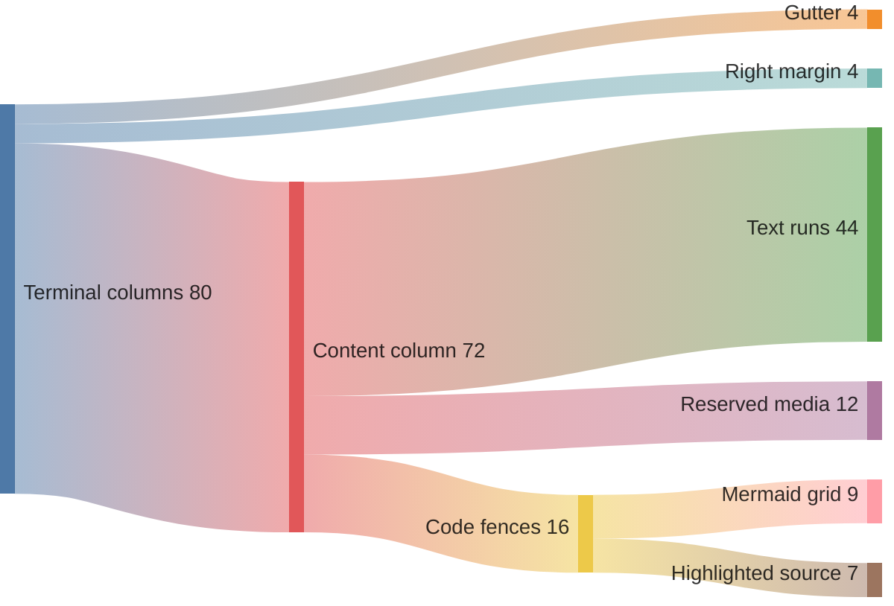

### xychart-beta — frame cost against document size

*expect: renders as a vertical bar chart with a numeric y-axis and categorical
x-axis; the `line` series is overlaid on the bars as `●` markers rather than
drawn as a separate curve; validate.mjs: pass.*

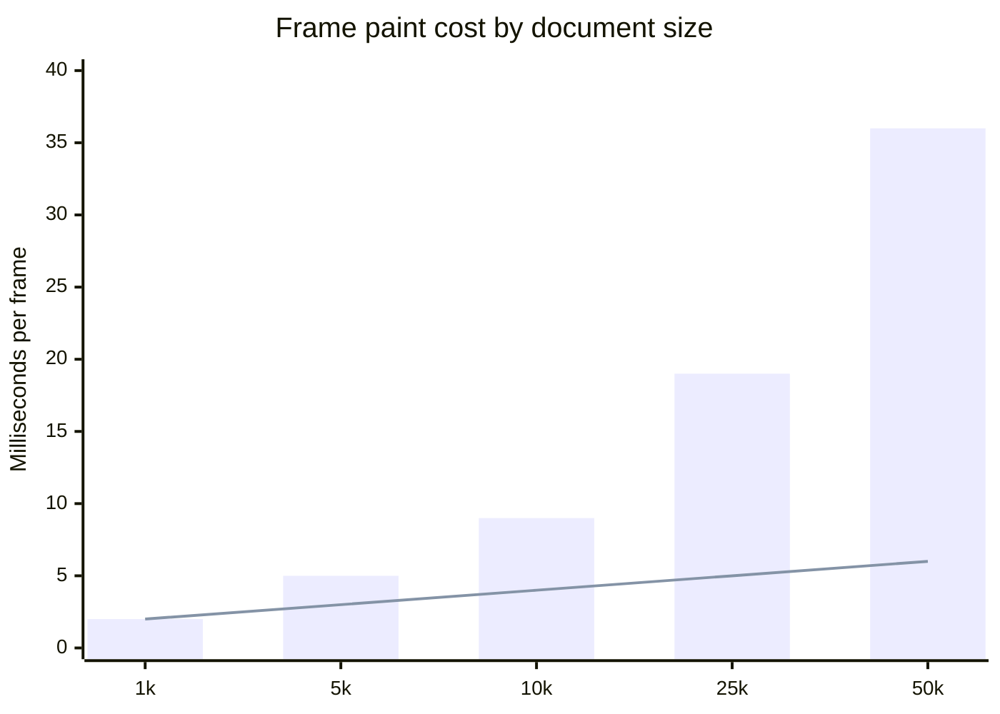

### block-beta — the pipeline as a fixed grid

*expect: renders as a 3-column grid of equal-width boxes with `►` between
horizontally adjacent blocks, plus an `Edges:` list below for the edges that
cross rows; validate.mjs: pass.*

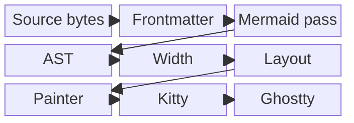

Only the row-crossing edges (`mmd --> ast`, `lay --> pnt`) appear in the
`Edges:` summary; the in-row ones are drawn inline as `►`.

### architecture-beta — the crate topology

*expect: renders as labelled group frames containing service boxes, laid out
vertically with connector stems. Icon names (`cloud`, `server`, `disk`,
`internet`) are parsed and discarded — this renderer draws no icons;
validate.mjs: pass.*


Edges are written **without** port specifiers. With `loader:R --> L:parser`
the fence still renders, but the services are laid out side by side and no
connector is drawn at all — the edges vanish silently. Port routing is stored
but deferred upstream, so port-form edges are a silent-defect trap here, not
a parse error.

### packet-beta — the APC payload stele emits

*expect: renders as a 32-bit-wide row table with a bit-number ruler above each
row and each field label centred in its bit range; validate.mjs: pass.*

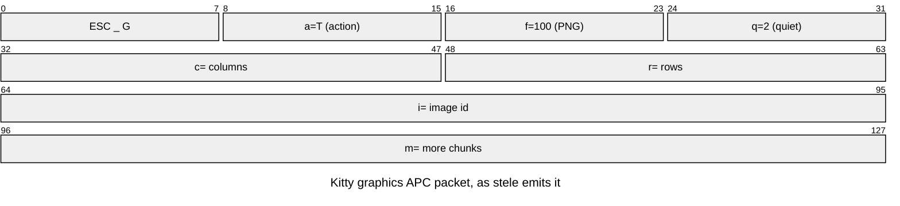

### pie — the math degradation ladder

*expect: renders as a horizontal bar chart (not a circle) with a centred
title, `█`/`░` bars and a percentage column; validate.mjs: pass.*

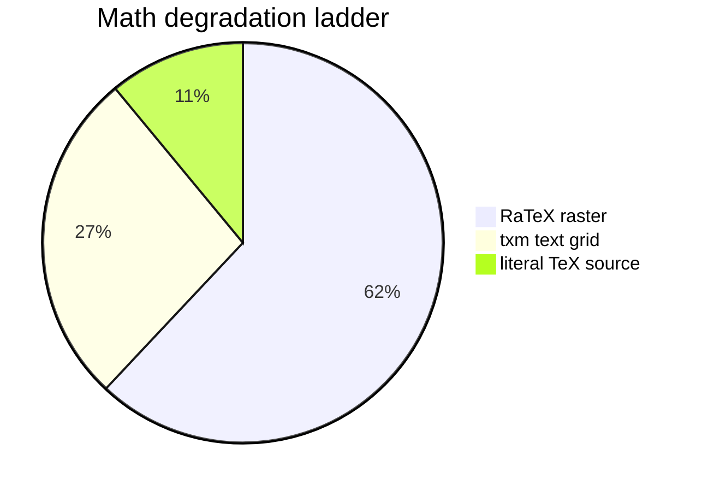

Pie slice labels **are** unquoted by the pie parser, so the quotes siren
requires here do not leak into the render — unlike flowchart node labels.

---

## Part 2 — layout extremes

### The smallest possible diagram

*expect: renders as a text grid, 37 columns × 3 rows — two boxes and one
arrow, nothing else; validate.mjs: pass.*

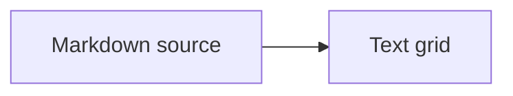

### A dense graph — 38 nodes, 38 edges

*expect: renders as a text grid, ~91 columns × 160 rows. Well past siren's
15–25 node readability ceiling on purpose: this is a layout stress test, not
a diagram anyone should copy. Expect long vertical runs and edge stems
threading between box columns; validate.mjs: pass — worth noting that the
static lint has no node-count rule, so nothing here flags the size.*

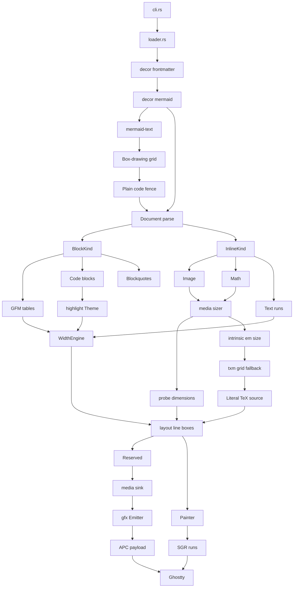

### Very wide — 243 columns, 4 rows

*expect: the grid renders at its full natural width of 243 columns. stele
applies **no** width budget to `mermaid::render`, so nothing scales; the
layout engine then clips each line at the content column and marks it with a
`…`. Expect a four-row band of truncated boxes, not a shrunken diagram;
validate.mjs: pass.*

```mermaid
flowchart LR
    file[/PNG on disk/] -->|header only| probe[Probe dimensions]
    probe -->|w x h px| cells[Convert to cells]
    cells -->|cap 40x20| box[Reserved box]
    box -->|scroll into view| decode[Bounded decode]
    decode -->|RGBA| chunk[Base64 chunk]
    chunk -->|4096 bytes| apc[APC transmit]
    apc -->|a=T| place[Place at cursor]
    place -->|next frame| repaint[Repaint behind]
    repaint -->|missed frame| sweep[Sweep and delete]
```

### Very tall — 46 columns, 113 rows

*expect: fits the content column comfortably and scrolls for several screens.
Worth watching while scrolling: the whole thing is a single code block, so it
must not re-wrap, re-measure or shift horizontally between frames;
validate.mjs: pass.*

```mermaid
flowchart TD
    q1[Query cell size] -->|CSI 16t| q2[Read pixel geometry]
    q2 -->|no reply| q3[Assume 24x48]
    q2 -->|reply| q4[Use reported size]
    q3 --> q5[Compute cells per image]
    q4 --> q5
    q5 --> q6[Clamp to 40x20 cells]
    q6 --> q7[Reserve box in layout]
    q7 --> q8[Paint frame]
    q8 --> q9[Transmit if visible]
    q9 --> q10[Track placement id]
    q10 --> q11[LRU cap 32]
    q11 --> q12[Evict oldest]
    q12 --> q13[Delete from terminal]
```

---

## Part 3 — labels

### Long node labels

*expect: renders as a text grid ~46 columns wide. The parser soft-wraps any
label past roughly 40 display columns onto a second line inside the box, so
the diagram stays narrow instead of exploding sideways. The surrounding
double quotes **are** part of the rendered label — see the next case;
validate.mjs: pass.*

```mermaid
flowchart TD
    long1["Header-only dimension probe that never decodes the full image at layout time"] --> long2["Bounded decode with a hard pixel cap, run only when the box scrolls into view"]
    long2 --> long3["Base64 chunked APC transmission in 4096-byte payloads with m=1 continuation"]
```

### Quotes, parentheses, unicode and emoji

*expect: renders as a text grid, 48 columns × 29 rows — and renders it
**wrong** in two specific, measured ways. Neither is a stele bug; both are
`mermaid-text` 0.57.0 behaviour, and both are why this case is in the doc;
validate.mjs: pass.*

1. **Quotes are not stripped from flowchart node labels.** `A["Quoted"]`
   renders as `│ "Quoted" │`, quote marks included. Edge labels and pie slice
   labels *are* unquoted; node labels are not. Since siren (correctly)
   requires quoting any label containing `()`, `[]` or `<>`, every such label
   shows its quotes in the terminal while rendering clean on GitHub.
2. **Box borders drift right on wide graphemes.** Measured on this exact
   diagram: the `🧵` box has a 45-column border and a 46-column content row —
   1 over. The `日本語 🇯🇵` box has a 45-column border and a 48-column content
   row — 3 over. Expect visibly ragged right edges on those two boxes and no
   others. The CJK run also renders with spurious gaps (`日 本 語`). Both
   symptoms are consistent with the box being *sized* in display columns and
   then *painted* into a per-character canvas; stele's own `width` crate is
   Ghostty-correct, and the grid it receives is already ragged before it
   arrives.

Two escaping routes that siren's `gotchas.md` recommends are unusable here,
which is why neither appears below:

- **HTML entities (`&quot;`, `#quot;`) silently shred the diagram.** A
  semicolon is a statement separator in flowcharts, so `&quot;` splits the
  label mid-token; `mermaid-text` then emits three garbage nodes
  (`C["Handles &quot`, `quoted&quot`, `bracketed] ones"`) and reports success.
  A silent defect, not an error.
- **Single-quoted labels (`A['has "quotes"']`) are a hard parse error in
  mmdc 11.16.0**, even though `mermaid-text` accepts them.

Typographic `“ ”` are the one form that survives both: no semicolon, no
delimiter clash, and width-1 so they cause no border drift.

```mermaid
flowchart TD
    A["Reads a byte at a time (never buffered)"] --> B["Emits ⟨grapheme, cell-count⟩ pairs 🧵"]
    B --> C["Handles “curly quoted” and [bracketed] runs"]
    C --> D["Café — naïve — 日本語 — 🇯🇵 — U+FFFD �"]
```

---

## Part 4 — fallback cases

Everything in this part is expected **not** to render. The success criterion
is that stele leaves the fence alone and paints an ordinary code block — no
panic, no partial grid, no swallowed content.

### Deliberately malformed source

*expect: falls back to a plain code fence. `mermaid-text` returns
`ParseError("unrecognised sequence diagram line: \"->> Bob: missing source\"")`
and the preprocessor leaves the span untouched, so this displays as a
`mermaid`-tagged code block with the broken source visible.*

*This diagram is invalid on purpose. validate.mjs reports an error on it, as
it should — that is a passing result for this test case, not a validator
failure. It carries a `%% validate-ignore` marker so a directory sweep does
not count it against the doc.*

```mermaid
%% validate-ignore — deliberately malformed, tests the code-fence fallback
sequenceDiagram
    Alice ->> : missing target
    ->> Bob: missing source
```

### Valid mermaid that this renderer cannot parse

*expect: falls back to a plain code fence. This is well-formed mermaid and
renders fine on GitHub, but the colon-shorthand member form is a documented
gap in `mermaid-text` v1 (`src/class.rs`), which returns
`ParseError("classDiagram: colon-shorthand member form not yet supported")`.
The interesting case: correct source, still a fallback; validate.mjs: pass —
the source really is valid mermaid.*

```mermaid
classDiagram
    class Renderer
    Renderer : +render(src) String
```

### Unsupported diagram type

*expect: falls back to a plain code fence via
`UnsupportedDiagram("unknowndiagramtype")` — detection fails on the first
non-blank, non-comment line before any parsing happens.*

*Invalid on purpose; validate.mjs reports an unknown diagram type, which is
the expected result here.*

```mermaid
%% validate-ignore — unknown diagram keyword, tests the detect() fallback
unknownDiagramType title Roadmap
    everything below this line is irrelevant
```

### Empty fence

*expect: falls back to a plain code fence. `render("")` returns
`EmptyInput`, so the fence survives and paints as an empty `mermaid` code
block — an empty box, not a blank gap and not a crash.*

```mermaid
```

### Whitespace-only fence

*expect: identical to the empty case — `EmptyInput` again, because detection
skips blank lines before it looks for a keyword.*

```mermaid
   
	
```

### Comment-only fence

*expect: falls back to a plain code fence. `detect()` skips `%%` comment
lines when hunting for the keyword line, finds none, and returns
`EmptyInput`.*

```mermaid
%% just a comment, no diagram keyword anywhere
%% and another one
```

---

## Part 5 — fences that are not top-level

Only top-level fences are preprocessed. Both diagrams below are perfectly
valid and would render fine at top level; nested, they must stay code fences.

### Inside a list item

*expect: **not** rendered. Stays a `mermaid`-tagged code block inside the list
item, at the list's indentation, with the list marker and indent intact;
validate.mjs: pass (the source is valid, it is simply never handed to the
renderer).*

1. First, the fence is found by the preprocessor's block walk.

2. Nested fences never appear in `Document::blocks()`, so this one is skipped:

   ```mermaid
   flowchart LR
       nested[Nested fence] --> plain[Stays a code block]
   ```

3. Third item, to prove the list structure survives the untouched fence.

- A bullet list too, with a different diagram type:

  ```mermaid
  stateDiagram-v2
      [*] --> Skipped: nested in a list
      Skipped --> [*]
  ```

- And a sibling bullet after it.

### Inside a blockquote

*expect: **not** rendered. Stays a code block inside the quote, with the
blockquote gutter painted down its left edge; validate.mjs: pass.*

> A quoted aside that happens to contain a diagram:
>
> ```mermaid
> flowchart LR
>     quoted[Quoted fence] --> plain[Stays a code block]
> ```
>
> and some quoted text after it, so the gutter has to survive the fence on
> both sides.

### Nested two deep

*expect: **not** rendered — a blockquote inside a list item is still not a
top-level block; validate.mjs: pass.*

- A list item containing a blockquote containing a fence:

  > ```mermaid
  > pie title Never rendered
  >     "Top-level" : 1
  >     "Nested" : 99
  > ```

---

## Part 6 — info-string handling

### Extra info-string attributes

*expect: renders as a text grid. The preprocessor takes the **first
whitespace-separated token** of the info string and compares it
case-insensitively to `mermaid`, so everything after the language tag is
ignored and the fence is still preprocessed; validate.mjs: pass.*

```mermaid title="The width ladder" showLineNumbers wrap=false
flowchart LR
    cluster[Grapheme cluster] --> table[Ghostty width table]
    table --> cells[Cell count]
```

### Uppercase language tag

*expect: renders as a text grid — the comparison is
`eq_ignore_ascii_case("mermaid")`; validate.mjs: pass.*

```MERMAID
flowchart LR
    upper[Uppercase tag] --> same[Same treatment]
```

### A tag that merely starts with "mermaid"

*expect: **not** rendered. `mermaidjs` is a different first token, so the
`eq_ignore_ascii_case` check fails and this stays a plain code block —
proving the check is an equality test, not a prefix test.*

```mermaidjs
flowchart LR
    prefix[Not the mermaid tag] --> plain[Stays a code block]
```

### A non-mermaid fence, for contrast

*expect: **not** rendered as a diagram — this is a Rust code block and should
be syntax-highlighted like any other.*

```rust
if let Ok(grid) = mermaid::render(literal) {
    let fenced = as_plain_fence(&grid);
    repls.push((block.span.start, block.span.end, fenced));
}
```
